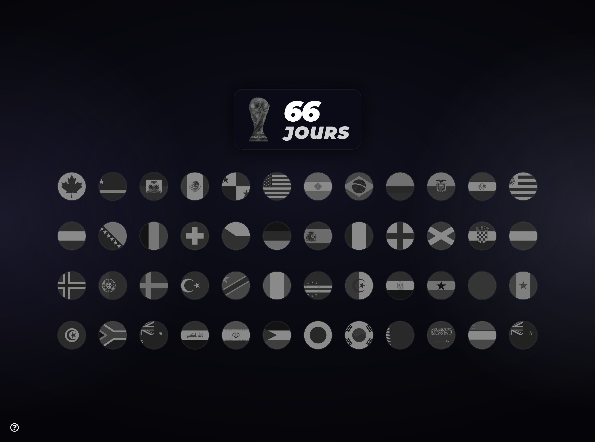
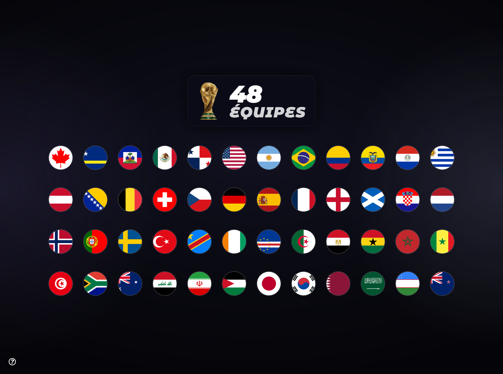

# CDM 2026

<div align="center">
    

Countdown, contenders & winner tracker

<a href="https://bun.sh"></a>
<a href="https://vitejs.dev"></a>
<a href="https://svelte.dev"></a>
<a href="https://pages.cloudflare.com"></a>
<a href="https://tailwindcss.com"></a>

</div>

SvelteKit web app dedicated to the 2026 FIFA World Cup.

## Acknowledgements

Inspired by the infographic used by the great [Wiloo](https://www.youtube.com/@wiloo) in his YouTube videos about the 2026 World Cup. This site is meant to make following the tournament more engaging ⚽.

## Features

- Countdown to the opening match
  
- Remaining contenders tracker
  
- Winner celebration

  _revealed at the end of the tournament_

## Usage

#### Prerequisites

[`Bun`](https://bun.sh)

#### Install dependencies

```sh
bun install
```

#### Development server

```sh
bun run dev
bun run dev -- --port XXXX
```

The default port is `5173`. To change the configuration, follow the [Vite documentation](https://vite.dev/config/server-options.html#server-port).

#### Build and preview

```sh
bun run build
```

```sh
bun run preview
```

#### Deployment

The build is designed to work with [`Cloudflare Pages`](https://pages.cloudflare.com).

Make sure you are using Build system version >= 2.

Build command:

```sh
bun install && bun run build
```

## Configuration

The main files to update when evolving the site are:

- `src/lib/config/site.ts`: opening match date
- `src/lib/data/nations.ts`: list of nations, `enabled` status, appearances, and confederations

## Sources

The site's content relies in particular on:

- [Flagpedia](https://flagpedia.net/download/api)
- [FIFA - World Cup 2026: Qualified teams](https://www.fifa.com/fr/tournaments/mens/worldcup/canadamexicousa2026/articles/coupe-du-monde-2026-equipes-qualifiees)
- [Wikipedia - National team appearances in the FIFA World Cup](https://fr.wikipedia.org/wiki/Apparition_des_%C3%A9quipes_dans_la_Coupe_du_monde_de_football)

## Author

Developed by [Horebz](https://github.com/HorebZ).

## License

The source code in this repository is distributed under the [MIT](./LICENSE) license.

Trademarks, logos, visuals, data, and content from third-party sources remain subject to their respective
licenses and terms of use.

🥅 ⚽
